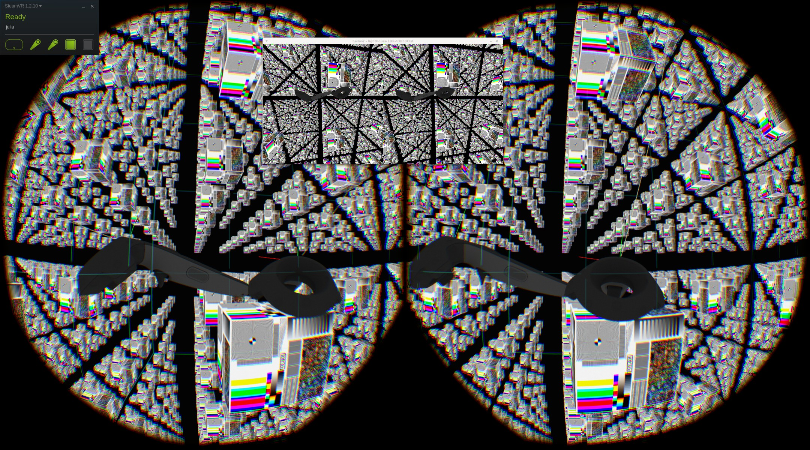

# OpenVR.jl

Here arises a binding of the [OpenVR-API](https://github.com/ValveSoftware/openvr) for the Julia programming language. _"OpenVR is a software development kit and application programming interface developed by Valve for supporting the SteamVR (HTC Vive) and other virtual reality headset devices"._[1](#wiki1) Currently the single _implementation_ of the open OpenVR-API indeed is Valve's proprietary [SteamVR](https://steamcommunity.com/steamvr) which most likely supports the [HTC Vive](https://www.vive.com/us/product/vive-virtual-reality-system/) family of head mounted devices (HMD). Note that on March 18, 2019 also a [pre-release of the OpenXR standard](https://www.khronos.org/news/press/khronos-releases-openxr-0.90-provisional-specification-for-high-performance-access-ar-vr-platforms-and-devices) (_Provisional Specification_) appeared which aims to provide a _"cross-platform standard, [for] VR and AR applications and engines"_.

<a name="wiki1">[1]</a> [Wikipedia](https://en.wikipedia.org/wiki/OpenVR)

# Documentation and examples

The C++ based API itself comes in a single file [openvr.h](https://github.com/ValveSoftware/openvr/blob/master/headers/openvr.h) where also a JSON representation, a C-binding and a C\#-binding are [located](https://github.com/ValveSoftware/openvr/tree/master/headers). The C and C++ version of the API do not differ that much and especially the Julia binding shows more similarity with the OpenVR C-API. Still, the current Julia-binding was created for the C++API using [CxxWrap.jl](https://github.com/JuliaInterop/CxxWrap.jl). There is an [API-Documentation](https://github.com/ValveSoftware/openvr/wiki/API-Documentation) and [samples for OpenGL, Vulkan and DX12](https://github.com/ValveSoftware/openvr/tree/master/samples).

The [hellovr_opengl](https://github.com/ValveSoftware/openvr/blob/master/samples/hellovr_opengl/hellovr_opengl_main.cpp) example was [ported to Julia](./test/hellovr_opengl_julia.jl) as a proof of concept. An OpenGL context is created by [SDL2](https://github.com/jonathanBieler/SimpleDirectMediaLayer.jl) in the example, but this could be also done by [GLFW](https://github.com/JuliaGL/GLFW.jl) or others. CxxWrap.jl helped a lot for gradually porting this C++ example, function after function, allowing to use the Julia and C++ functions exchangably. Our completed port of the hellovr_opengl example does not rely on the original C++ anymore and no struct-layout compatibility needs to be maintained. Therefore it should be easier to replace the OpenVR C++API binding with a C-API binding for that ported example, removing the necessity of compiling a CxxWrap-shared-library.

## hellovr_opengl example

The hellovr_opengl example [hellovr_opengl_main.cpp](https://github.com/ValveSoftware/openvr/blob/master/samples/hellovr_opengl/hellovr_opengl_main.cpp) is a very verbose piece of C++ and a little misleading.
Nonetheless it is ported to [hellovr_opengl_julia.jl](./test/hellovr_opengl_julia.jl) and features

- rendering setup and _submit_ of OpenGL textures to OpenVR:
  - VR_Init
  - GetRecommendedRenderTargetSize
  - Submit
  - VR_Shutdown
- getting the current transformation data for the controllers, the head mounted display and each eye:
  - GetEyeToHeadTransform
  - GetPoseActionData
  - GetProjectionMatrix
- controller interaction setup:
  - SetActionManifestPath
  - GetActionHandle
  - GetActionSetHandle
  - GetInputSourceHandle
  - GetStringTrackedDeviceProperty
  - GetOriginTrackedDeviceInfo
  - GetTrackedDeviceClass
- getting _render models_ of the controllers for the purpose of rendering them (manually):
  - GetRenderModelErrorNameFromEnum
  - LoadRenderModel_Async
  - LoadTexture_Async
  - FreeRenderModel
  - FreeTexture
- processing _events_:
  - PollNextEvent
  - IsInputAvailable
  - UpdateActionState
  - GetAnalogActionData
  - GetDigitalActionData
  - VREvent_TrackedDeviceDeactivated
  - VREvent_TrackedDeviceUpdated
- force feedback:
  - TriggerHapticVibrationAction

TODO: Currently the code contains lots of remains of the memory-layout compatible version that can be omitted by using _just_ normal, mutable Julia structs and Julia arrays.

# Expected issues

C++ makes use of the [Resource acquisition is initialization idiom](https://en.wikipedia.org/wiki/Resource_acquisition_is_initialization) for it's objects[[regions of storage]](https://en.cppreference.com/w/cpp/language/object) and has notions for _lifetime_, _storage duration_ and _copyability_[[POD]](https://en.wikipedia.org/wiki/Passive_data_structure),[[non-trivial for the purposes of calls]](https://itanium-cxx-abi.github.io/cxx-abi/abi.html#non-trivial),[[POD for the purpose of layout]](https://itanium-cxx-abi.github.io/cxx-abi/abi.html#POD) of such.

Julia instead uses a garbage collector, has a notion of _bitstype_[is garbage collected], passes values of non-bitstype by reference (call by _sharing_) and it does not _move_ already allocated objects[regions of storage].

This becomes a lesser issue since OpenVR - as well as most C-API's - does not frequently allocate memory. It requires already-alloced memory for output to be passed in as pointers.

The OpenVR-API makes use of two C/C++-Unions: for VREvent_Data_t and VROverlayIntersectionMaskPrimitive_Data_t. The knowledge of _which_ data really is present in the union only arises from VREvent_t and VROverlayIntersectionMaskPrimitive_t respectively which contain these unions. A function getUnion is provided that implements an interpretation of the _comments_ from the original header file.

# Less known issues

C (and therefore C++) "is" _row-major_ where Julia "is" _column-major_. Although one can implement any-major matrices - e.g. even the C++ hellovr_opengl example implements its own column-major matrices in C++ - the OpenVR-API makes use of this in the definition of HmdMatrix34_t, HmdMatrix33_t and HmdMatrix44_t. Therefore, when layout matching them with an SArray from StaticArrays.jl, we observe the transposed matrix in Julia.

Julia structs follow slightly different alignment rules than C structs. This lead to splitting a UInt64 into two UInt32 for layout conformance e.g. for
- RenderModel_TextureMap_t.rubTextureMapData
- RenderModel_t.rIndexData
